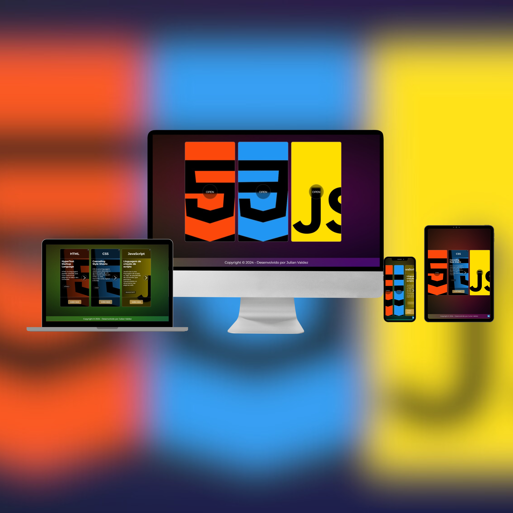

<h1>🔹 Card Animation</h1>

Bem-vindo ao repositório do meu projeto! Trata-se de uma página web interativa <b>Card Animation</b>! 
Este projeto apresenta cartões animados e informativos sobre as tecnologias HTML, CSS e JavaScript, com um design dinâmico e intuitivo.

 
<video src="https://github.com/valdezjulian/card-animation/assets/140128700/9ad62e44-9a9f-4f26-8970-16e0add48bd1" ></video>
<h2>Visão Geral</h2>

Esta página web foi desenvolvida para demonstrar de forma interativa e visualmente atraente as características e utilidades das tecnologias HTML, CSS e JavaScript. 
O objetivo é criar uma experiência de usuário envolvente e educativa.

 
<h2>Funcionalidades</h2>

<b>• Cartões Interativos:</b> Cada cartão aborda um tópico (HTML, CSS, JavaScript) e abre para revelar mais informações detalhadas.

<b>• Design Animado:</b> Fundo com animações suaves e cores vibrantes que proporcionam uma experiência visual dinâmica.

<b>• Imagens e Botões Responsivos:</b> Cada cartão possui uma imagem representativa e botões interativos que direcionam para mais informações.

<b>• Rodapé Informativo:</b> Contém uma mensagem de agradecimento e um link para o perfil do desenvolvedor no LinkedIn.

 
<h2>Tecnologias Utilizadas</h2>

<b>• HTML5:</b> Para a estruturação do conteúdo.

<b>• CSS3:</b> Para o estilo, as animações e interatividade.

 

 
